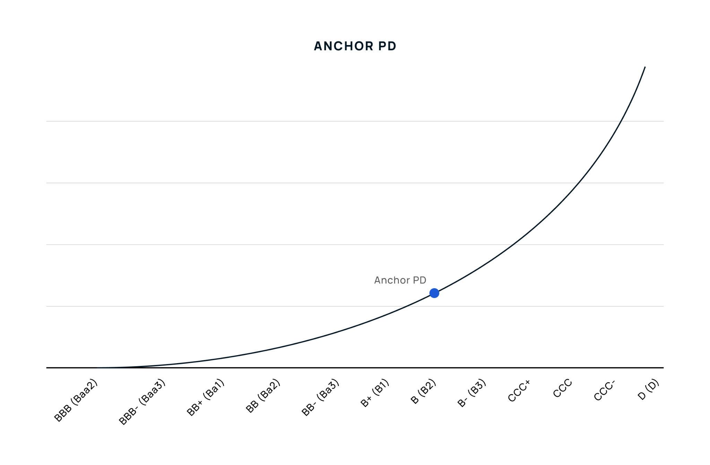
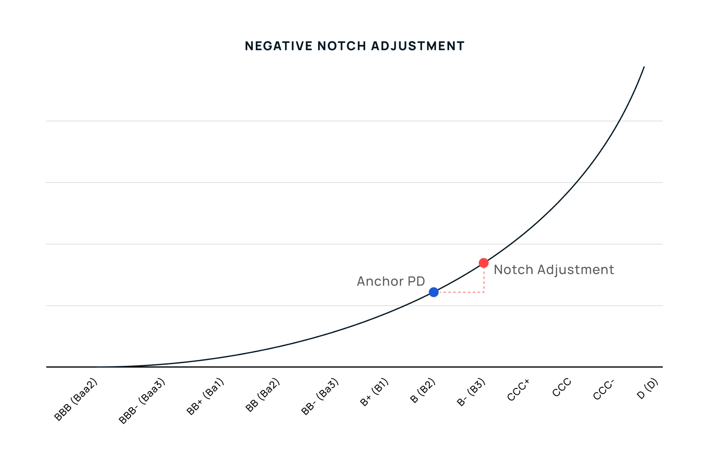
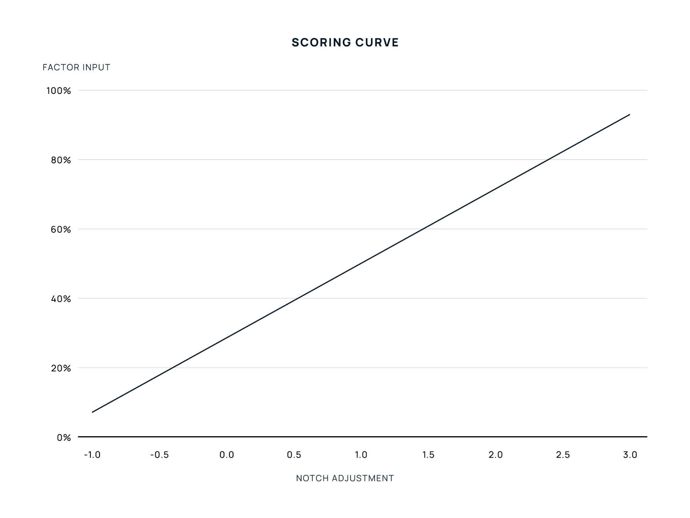

# Core Methodology Concepts

### PD Curve 

All Credora methodologies rely on the **Credora PD Curve**, a uniform underlying probability of default (PD) curve. The curve fundamentally enables a comparison of risk across various Credora methodologies (Derivative Tokens, Stablecoins, General Corporate Issuer, Receivables Financing, etc.) and enables direct comparisons between Credora ratings and credit ratings assigned by traditional rating agencies.

In the application of any Credora methodology, the probability of default quantification results from selecting a starting point on the Credora PD Curve via calculating an **Anchor PD**, and subsequently applying shifts along the curve via **Modifiers**. The Anchor PD and Modifier mechanics are further explained in the Credora Token Rating Framework documentation.

Traditional rating agency ratings scales are widely ingrained in the financial system and recognized by institutions and individual market participants. The Credora PD Curve is derived from analysis of the historic realized defaults across debt issuances rated by major US ratings agencies, including S\&P, Moody’s, and Fitch.

#### Calculation 

Credora starts by comparing the one-year global historical default rates by the three major credit agencies for each rating tier. The underlying data set spans at minimum 1990 to 2023, and therefore includes different credit cycles. Although the rating scale designations differ slightly across ratings agencies, Credora normalizes them on a single rating scale.

Average default rates across major agency rated issuers and issuances are calculated for each rating tier, and a curve is interpolated. The image below shows the Credora PD Curve and the three rating agencies' historic realized default rates.

.png>)

Credora uses exponential interpolation to define a function for the curve equation. The objective is to fit the data to an exponential model of the form , where **y** is the value at observation **x**, **a** is a scaling factor, and **b** represents the growth rate, fitted to the data points. Because agencies combine the realized C, CC and CCC default rates in aggregate, an intermediate exponential interpolation is used to obtain the points for CCC+, CCC-, CC and C.

Based on this formula, the below table is established, representing the Credora PD curve ranges and their corresponding implied ratings:

| **Ratings**     | **Notches** | **PD Mid** | **PD Lower** | **PD Upper** |
| --------------- | ----------- | ---------- | ------------ | ------------ |
| **AAA (Aaa)**   | 1           | 0.001%     | 0.001%       | 0.001%       |
| **AA+ (Aa1)**   | 2           | 0.002%     | 0.001%       | 0.002%       |
| **AA (Aa2)**    | 3           | 0.003%     | 0.002%       | 0.004%       |
| **AA- (Aa3)**   | 4           | 0.005%     | 0.004%       | 0.007%       |
| **A+ (A1)**     | 5           | 0.010%     | 0.007%       | 0.013%       |
| **A (A2)**      | 6           | 0.018%     | 0.013%       | 0.024%       |
| **A- (A3)**     | 7           | 0.033%     | 0.024%       | 0.045%       |
| **BBB+ (Baa1)** | 8           | 0.061%     | 0.045%       | 0.083%       |
| **BBB (Baa2)**  | 9           | 0.11%      | 0.083%       | 0.15%        |
| **BBB- (Baa3)** | 10          | 0.21%      | 0.15%        | 0.29%        |
| **BB+ (Ba1)**   | 11          | 0.39%      | 0.29%        | 0.53%        |
| **BB (Ba2)**    | 12          | 0.72%      | 0.53%        | 0.98%        |
| **BB- (Ba3)**   | 13          | 1.34%      | 0.98%        | 1.82%        |
| **B+ (B1)**     | 14          | 2.48%      | 1.82%        | 3.37%        |
| **B (B2)**      | 15          | 4.59%      | 3.37%        | 6.25%        |
| **B- (B3)**     | 16          | 8.51%      | 6.25%        | 11.58%       |
| **CCC+**        | 17          | 15.77%     | 11.58%       | 21.47%       |
| **CCC**         | 18          | 29.22%     | 21.47%       | 39.78%       |
| **CCC-**        | 18.75       | 46.42%     | 39.78%       | 54.16%       |
| **CC**          | 19.25       | 63.20%     | 54.16%       | 73.74%       |
| **C**           | 19.75       | 86.03%     | 73.74%       | 99.99%       |
| **D (D)**       | 20          | 100%       | 100%         | 100%         |

#### Interpretation 

Historically, realized defaults exponentially increase as credit ratings incrementally decline. Credora methodologies operate in PD terms, and the Credora PD Curve serves as a foundation for producing an **Implied Rating** and **Score**.

By enabling the comparison of risk across the digital asset economy and traditional financial markets, Credora aims to enhance stakeholder ability to think and act in risk-reward terms.

#### Score 

Traditional ratings scales may be difficult for the average user to interpret. As a result, Credora has adopted a numerical score, which is derived from the PD Mid column in the above table. The numerical score is calculated using a power transformation.

This approach converts the PD Mid values to a 0-10 rating scale. The purpose is to ensure that lower PD values receive higher ratings in a manner that allows sufficient differentiation across the entire rating spectrum, from “AAA” to “D.”

In the application of the power transformation, lower PDs are mapped to higher scores. The approach first raises the PD to a power exponent (α) to ensure clustering at the low or high ends by stretching out higher PDs more than a simple logarithmic transformation. Following the power transform, the model applies an inverted min–max normalization to map the PDs into a 0-10 scale with sufficient granularity to differentiate across the spectrum.

From a practical point of view, scores near 10 signal minimal default risk, those around 7.5 suggest moderate risk, and values below 6.5 indicate high risk equivalent to speculative ratings assigned in traditional finance. As with any generally accepted and widely used rating scales, these figures aim to demonstrate relative risk rather than absolute default risk, which is more adequately captured by a PD.

In producing a Score, Credora utilizes the PD Mid for the respective rating output. This reduces granular differentiation, effectively resulting in the rating driving the score output. This approach is consistent across ratings for underlying assets, markets and vaults. The table below demonstrates the Score mapping.\

| **Rating** | **PD Mid** | **Score (0-10)** |
| ---------- | ---------- | ---------------- |
| AAA        | 0.001%     | 10.0             |
| AA+        | 0.002%     | 9.9              |
| AA         | 0.003%     | 9.8              |
| AA-        | 0.005%     | 9.7              |
| A+         | 0.010%     | 9.5              |
| A          | 0.018%     | 9.3              |
| A-         | 0.033%     | 9.1              |
| BBB+       | 0.061%     | 8.9              |
| BBB        | 0.11%      | 8.6              |
| BBB-       | 0.21%      | 8.3              |
| BB+        | 0.39%      | 7.9              |
| BB         | 0.72%      | 7.5              |
| BB-        | 1.34%      | 7.0              |
| B+         | 2.48%      | 6.4              |
| B          | 4.59%      | 5.7              |
| B-         | 8.51%      | 4.9              |
| CCC+       | 15.77%     | 3.9              |
| CCC        | 29.22%     | 2.8              |
| CCC-       | 46.42%     | 1.8              |
| CC         | 63.20%     | 1.1              |
| C          | 86.03%     | 0.4              |
| D          | 100%       | 0.0              |

### Anchor PD & Modifiers 

All Credora methodologies have common core components, including the determination of an Anchor PD and the application of Modifiers. The Anchor PD quantifies the foundational or base risk, and Modifiers are applied as adjustments to the Anchor PD. For the analysis of any specific asset, issuer, or debt issuance, sub-methodologies are typically utilized. These sub-methodologies may also have Anchor PD and Modifier components, where the output of the sub-methodology is utilized as an Anchor PD input in a subsequent methodology. In other words, the methodology structure is nested.

Modifiers are applied in the form of notch adjustments along the Credora PD Curve. They assess various types of risk which are not encapsulated by the Anchor PD. A single notch corresponds to a step in the rating, and is either a positive notch adjustment (lower PD) or a negative notch adjustment (higher PD). The application of the Modifiers results in a **Final PD**, which corresponds to an implied rating.

The methodology structure adopts best practices from major ratings agencies, who similarly utilize Anchor PD and Modifiers as core concepts.

#### Anchor PD Determination 

Conceptually, the Anchor PD represents the starting point for quantifying the probability of default for a specific asset, issuer, or debt issuance. The relevant sub-methodology or approach targets the primary risk characteristics, and relies on empirical evidence to quantify the Anchor PD.

See the below examples across different methodologies:

- For fiat-backed stablecoins, the Anchor PD is calculated from an assessment of Asset Quality (i.e. the risk of reserves) and Counterparty Risk (i.e. the risk of the entities custodying reserves).
- For general corporate issuers, the Anchor PD is calculated from an assessment of Geographic Risk, Industry Risk, and Scale Risk.

#### Modifier Determination 

Modifiers further differentiate tokens by evaluating relevant risk variables which are not captured by the Anchor PD. Their application as modifiers allows the methodology to encapsulate their relative impact on risk, from the starting point established by the Anchor PD.

Modifiers selection, organization, and analysis follow the below process:

1. Modifiers are selected based on a peer group analysis, academic research, industry research reports, and stakeholder feedback.
2. Modifiers are organized thematically, allowing for an understanding of the collective impact of modifiers that evaluate a specific aspect of risk.
3. Modifier multicollinearity is assessed to identify and address explanatory overlap.

**Notch Adjustments**

The magnitude of a notch adjustment for a specific modifier is calculated through one of two methods: (i) a quantitative input is analyzed on a scoring curve, which translates the input to a notch adjustment or (ii) a table selection is made, and corresponds to a specific notch adjustment.

Credora analyzes the magnitude of modifiers and their impact on differentiating comparable tokens. The respective curves and tables evolve as incremental information enables an increasingly accurate parameterization of the methodology.

**Scoring Curves**

Scoring curves are applied where the methodology aims to capture the impact a marginal change in a variable has on risk. The input is compared with a benchmark curve that sets the minimum and maximum value and their corresponding notch adjustment.

Scoring curves are typically utilized to analyze a risk factor relative to a peer group. The selection of a relevant peer group informs the minimum, maximum, and shape of a Modifier’s scoring curve.

See the below examples across different methodologies:

- For fiat-backed stablecoins, a modifier evaluates the market capitalization relative to the median market capitalization of all eligible stablecoins. The stablecoin market capitalization divided by median stablecoin market capitalization is evaluated on a scoring curve.
- For general corporate issuers, a modifier evaluates the current ratio of a specific company. The relevant minimum and maximum are set according to peer analysis, and the current ratio is evaluated on a scoring curve.

**Scoring Tables**

Scoring tables are utilized when a variable's impact on creditworthiness is best represented through categorical assignment. Each scoring factor includes predefined ranges or characteristics that correspond to specific notch adjustments.

See the below examples across different methodologies:

- For wrapped tokens, a modifier evaluates reserve transparency and assigns a notch adjustment based on the following criteria: on-chain validation, audited proof of reserves, unaudited proof of reserves, or no reserve traceability.
- For receivables financing issuances, a modifier evaluates the legal structure of the offering, assigning a notch adjustment if the issuance is done via an SPV or directly via an operating company.
