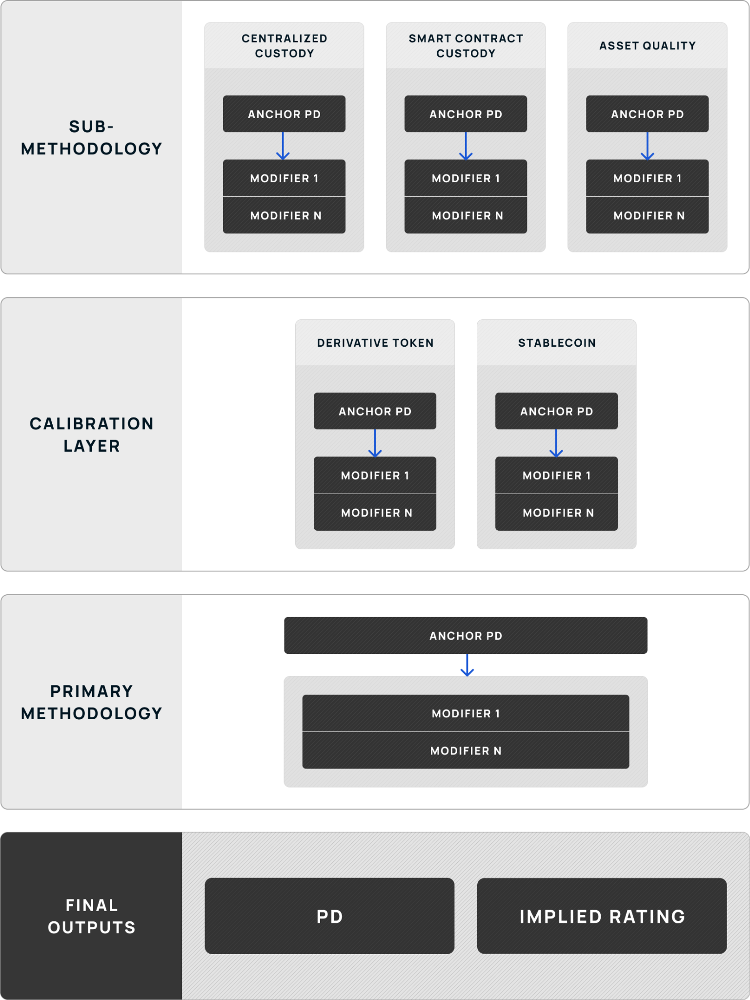

# Token Rating Framework

Credora token methodologies are designed to provide a comprehensive risk assessment for a wide range of tokens, capturing unique characteristics and risks inherent to their structures. The **Token Rating Framework** is a layered and integrated set of methodologies. Outputs generated by certain sub-methodologies serve as inputs for subsequent methodologies. This approach ensures foundational risk evaluations are incorporated into broader assessments. The structure enables a comprehensive and consistent process.

### Token Categories 

Tokens rated under the **Token Rating Framework** are divided into two primary categories, **Derivative Tokens** and **Stablecoins.**

#### Derivative Tokens 

The first category, **Derivative Tokens**, includes **Wrapped Tokens**, **Liquid Staking Tokens**, and **Liquid Restaking Tokens**.

1. **Wrapped Tokens (WT):** A Wrapped Token is a digital asset that represents and is pegged to the value of a cryptocurrency from the same or another blockchain, enabling seamless interoperability and use across different ecosystems and protocols. WTs rely on collateral held in custody—either by smart contracts or centralized custodians. The primary risks associated with WTs stem from the security and integrity of the custodial structure. For smart contract-based custody, vulnerabilities such as exploits or inadequate audits can jeopardize the collateral and lead to systemic failures. For centralized custody, the operational resilience, transparency, and creditworthiness of the custodian are critical risk factors. Any failure to secure the underlying collateral directly impacts the token's redeemability and value.
2. **Liquid Staking Tokens (LST):** Liquid Staking Tokens represent ownership claims on staked digital assets. A staked digital asset is a digital asset programmatically locked in a blockchain network to support operations like validating transactions, earning rewards in return. In addition to risks stemming from smart contract custody, these tokens expose investors to risks tied to validator performance and slashing events. Slashing, a penalty mechanism for validator misconduct or downtime, can erode the collateral underpinning the token. Additionally, as liquid staking tokens rely on staking protocols with interconnected systems, operational and governance policies may amplify risks.
3. **Liquid Restaking Tokens (LRST):** Liquid Restaking Tokens represent ownership claims on LSTs that have been re-staked on separate protocols, enabling additional yield opportunities. LRSTs rely on staked assets held in custody, primarily locked in smart contracts. Similar to LSTs, LRST risks include validator performance and smart contract custody. LRSTs extend staking activities across multiple protocols, compounding the potential rewards and associated slashing risks. These tokens face heightened exposure to validator performance due to their reliance on interconnected staking systems. Additionally, operational complexity increases the likelihood of coordination failures, while the use of multiple protocols may amplify vulnerabilities in governance and smart contracts. The intricate dependencies inherent in LRST structures make them particularly sensitive to cascading risks.

#### Stablecoins 

**Stablecoins** encompass tokens designed to maintain a stable value, which are typically pegged to a fiat currency. These tokens are evaluated based on the mechanisms that support their value stability, with each structure presenting distinct risk considerations. Stablecoins may rely on fiat-backed collateral, digital representations of cash and cash equivalents, or alternative asset collateral as reserves to support the stablecoin's peg. Each of these structures introduce specific vulnerabilities such as reserve sufficiency, peg maintenance, and stability under stress scenarios. Similar to Derivative Tokens, the custodial exposure of these tokens can rely on either smart contract custody or centralized custody, which necessitates different paths to analyze the foundational risks.

By grouping tokens into these two categories, Credora tailors risk assessment methodologies to the distinct features and challenges associated with each type.

### Framework Architecture 

The architecture of this framework is specifically designed to accommodate the evaluation of a broad spectrum of tokens, recognizing that risk exposures differ significantly based on the unique structural components and foundational risks associated with each token.

The framework comprises three distinct layers: the [**Sub-Methodology Layer**](sub-methodologies/), [**Calibration Layer**](calibration-layer/), and [**Primary Layer**](primary-layer-general-token-modifiers.md), where subsequent layers progress the assessment closer towards the final outputs. The layers are interconnected, in that outputs from a preceding layer are utilized as inputs in a subsequent layer. In each layer, inputs are refined through bespoke modifiers that account for the token-specific risk characteristics. This approach ensures a comprehensive and flexible assessment, tailored to the diverse and evolving nature of token structures. The diagram below illustrates the interaction and flow between the layers, highlighting how the framework integrates and processes varying risk factors across different token types.

#### Sub-Methodology Layer 

The Sub-Methodology Layer forms the foundation of the framework and is divided into three key components: the [**Smart Contract Custody Sub-Methodology**](sub-methodologies/smart-contract-custody-sub-methodology.md), [**Centralized Custody Sub-Methodology**](sub-methodologies/centralized-custody-sub-methodology.md), and **Asset Quality Sub-Methodology**.

- **Smart Contract Custody Sub-Methodology**: Evaluates the risks associated with tokens that utilize smart contract-based custody structures. Key risk factors include network vulnerabilities, audit quality, bridge risks, oracle risks, and contract maturity. It exists to address the unique security and operational risks inherent in decentralized custody mechanisms.
- **Centralized Custody Sub-Methodology**: Assesses tokens relying on centralized custodians for collateral management. It considers the custodian's creditworthiness, operational resilience, regulatory oversight, and transparency. This methodology exists to evaluate the risks tied to counterparty reliance and the robustness of traditional custody structures.
- **Asset Quality Sub-Methodology:** Assesses the risk of underlying reserve assets backing a token. Depending on the nature of the token and underlying reserve assets, the sub-methodology either utilizes direct ratings, market proxies, a Monte Carlo simulation, or application of the Merton Model.

Each sub-methodology produces an **Anchor PD**, which represents the foundational risk associated with the token's custodial architecture.

### Calibration Layer 

The Calibration Layer serves as the intermediary between the Sub-Methodology Layer and the Primary Layer. It applies token-specific calibration layer modifiers to adjust the Anchor PD based on additional characteristics unique to each token category.

For instance, Derivative Tokens utilizing centralized custody structures also carry risks associated with smart contract exposures for token minting and burning processes, which fall outside the scope of the Centralized Custodian Sub-Methodology. Similarly, stablecoins may face additional risks not fully addressed through custodial exposure sub-methodologies, such as vulnerabilities linked to reserve management practices. To account for these additional layers of risk, the Calibration Layer modifiers applies targeted adjustments, ensuring these exposures are accurately incorporated into the overall risk assessment.

The output of this section is the Calibrated Anchor PD, which is the foundational input of the Primary Layer.

### Primary Layer: General Token Modifiers 

The **Primary Layer** enhances the assessment by incorporating a set of fundamental, token-agnostic risk measures that are relevant across all token types, which are referred to as **General Token Modifiers**. For further details on how these adjustments are implemented, please refer to the specific documentation on the [Primary Layer](primary-layer-general-token-modifiers.md). These modifiers and adjustments—**Collateralization**, **Asset Transparency**, **Peg Track Record**, **Total Value Locked (TVL)**, **Governance and Dependencies**—capture core characteristics that underpin the stability, integrity, trustworthiness and market reputation of tokens. By focusing on these universal factors, this layer further evaluates and differentiates foundational token risks. This approach ensures that material risks, including those not explicitly captured in the sub-methodology layer or calibration layer are systematically integrated into the assessment, providing a comprehensive view of the token's risk profile.
